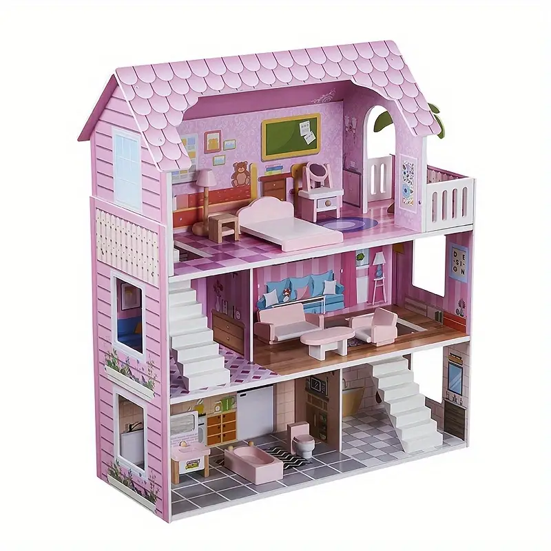

# DollhouseDev

> A spatial, multi-agent AI development environment. Watch worker agents
> (claude-code, gemini-cli, opencode, Ollama, apfel) navigate a 3D pink
> Victorian dollhouse as they tackle subtasks routed by a central Delegator.



DollhouseDev wraps terminal-based AI coding CLIs and HTTP-streaming local
LLMs behind a real-time 3D React Three Fiber scene. A central Delegator
breaks down user tasks, spawns worker agents as child processes / HTTP
streams, assigns each to a room, and renders each as an animated procedural
doll that walks to its room and switches between **idle / walking /
working** animations driven by live stdout activity.

---

## Stack at a glance

| Layer | Choice |
| --- | --- |
| Monorepo | pnpm workspaces (4 packages: `shared`, `backend`, `frontend`, `editor`) |
| Backend | Node + Express + Socket.IO + node-pty + undici |
| Frontend | Vite + React 18 + React Router + React Three Fiber + drei + @react-spring/three + zustand + Tailwind + xterm.js |
| Editor | `@dollhouse/editor` — R3F model editor: select / move / scale / resize / (un)group with undo-redo |
| LLM providers | Anthropic / OpenRouter / Gemini / Ollama / `mock` (offline) |
| Worker agents | claude-code, gemini-cli, opencode (PTY) · Ollama, apfel (HTTP) · echo (mock) |

---

## Quick start

```bash
# 1. install
pnpm install

# 2. optional: configure a real LLM provider for the Delegator
cp .env.example .env
$EDITOR .env       # set LLM_PROVIDER and the matching API key

# 3. run backend + frontend together
pnpm dev
# → backend at http://localhost:4000
# → frontend at http://localhost:5173
```

Open <http://localhost:5173>. Set a workspace, type a master task, hit
**Delegate**, watch the dolls move in.

The default `LLM_PROVIDER=mock` works offline and routes subtasks by
keyword — perfect for demos without burning tokens.

To edit the dollhouse or doll models, open <http://localhost:5173/editor>
(or click **Open Model Editor** on the home page).

---

## Architecture

```
┌──────────────────────── frontend (Vite + React + R3F) ────────────────────────┐
│  3D Scene (R3F)               │  2D HUD (Tailwind + xterm.js)                 │
│  ├─ <Dollhouse/>              │  ├─ <WorkspacePicker/>                        │
│  │   procedural rooms         │  ├─ <MasterChat/> (delegator I/O)             │
│  ├─ <Doll agent=.../>         │  ├─ <AgentTabs/> → <Terminal/>                │
│  │   walking/working/idle FSM │  └─ <DelegatorPlanView/>                      │
│                               │                                               │
│  Zustand store ←──── Socket.IO client ─────┐                                  │
└────────────────────────────────────────────┼──────────────────────────────────┘
                                             │
                              Socket.IO events (typed via @dollhouse/shared)
                                             │
┌──────────────────── backend (Node + Express + Socket.IO) ─────────────────────┐
│  WorkspaceManager ── validates CWD, optional git clone                        │
│  Delegator        ── LLMProvider.plan(prompt) → Task[]                        │
│                       └── Anthropic | OpenRouter | Gemini | Ollama | Mock    │
│  AgentCoordinator ── for each Task → AgentRegistry.spawn(type, …)             │
│  AgentRegistry    ── factory: type → AgentTransport                           │
│                                                                               │
│  AgentTransport (abstract)                                                    │
│   ├─ PtyTransport       — node-pty: claude-code, gemini-cli, opencode         │
│   ├─ HttpStreamTransport — fetch+SSE/NDJSON: Ollama (11434), apfel (11436)    │
│   └─ EchoTransport       — synthetic data for demos                            │
└───────────────────────────────────────────────────────────────────────────────┘
```

The key design insight: **the 3D scene never knows whether an agent is a
PTY or an HTTP stream**. Both surface as `{agentId, data}` chunks on the
wire, so the animation FSM stays pure.

---

## Wire protocol

All Socket.IO events live in `packages/shared/src/events.ts` and are
typed end-to-end.

### Client → Server

| Event | Payload |
| --- | --- |
| `set_workspace` | `{ path, isGit }` |
| `submit_master_task` | `{ prompt }` |
| `agent_input` | `{ agentId, input }` (stdin) |
| `kill_agent` | `{ agentId }` |

### Server → Client

| Event | Payload |
| --- | --- |
| `heartbeat` | `{ ts }` |
| `workspace_ready` | `{ path, status, message? }` |
| `delegator_plan` | `{ plan, tasks[] }` |
| `agent_spawned` | `{ agentId, type, assignedRoom, pid?, label }` |
| `agent_stdout` | `{ agentId, data }` |
| `agent_exit` | `{ agentId, code }` |
| `log` | `{ level, message }` |

---

## Rooms

Each room has a fixed world position; the Delegator (or the heuristic
fallback) picks one per subtask.

| Room | Hint kinds | Typical agent |
| --- | --- | --- |
| Studio (top-right) | ui, frontend, component, css, design | claude-code |
| Workshop (ground-right) | api, backend, server, db, infra | opencode |
| Library (mid back) | docs, readme, writing | gemini-cli |
| Kitchen (ground-left) | refactor, cleanup, format | claude-code |
| Bathroom (ground-center) | test, debug, fixture | ollama |
| Living Room (mid-left) | product, spec, planning | claude-code |
| Bedroom (top-left) | idle, rest | (idle pool) |
| Nursery (top-right) | experiment, prototype, sandbox | apfel |

Room positions live in `packages/shared/src/rooms.ts` and are imported by
both backend (for delegation hints) and frontend (for doll target coords).

---

## Model editor

The dollhouse and dolls are **data, not code**. `@dollhouse/shared` defines a
typed model schema — a `SceneNode` tree with `GeometryDef` / `MaterialDef` and
`DollhouseDocument` / `DollModel` wrappers. `buildDollhouseDocument()` and
`buildDollDocument()` are the default documents the frontend renders through
`<ModelRenderer>`.

`@dollhouse/editor` is a React Three Fiber editor for those documents, reachable
at **`/editor`**. Inspired by three.js's editor, it provides:

- **Select** — pick nodes in the viewport or outliner (shift-click to multi-select)
- **Pan** — left-drag to slide the camera (a hand tool)
- **Move / Rotate / Scale** — a drei `TransformControls` gizmo
- **Resize** — edit raw geometry parameters (box width/height/depth, sphere radius, …)
- **Group / Ungroup** — wrap or dissolve nodes, preserving world transforms
- **Undo / Redo** — full command-pattern history
- **Save / Export / Import** — JSON; Save persists to `localStorage`

The editor core (`packages/editor/src/core/`) is framework-agnostic — document
model, commands, history, three.js conversion, serialization. The React layer
(`src/react/`) wraps it; `<ModelRenderer>` is canvas-agnostic and is what the
frontend consumes for both the dollhouse and the dolls. Saved documents land in
`localStorage` and the frontend picks them up on next load.

---

## Adding a new agent type

```ts
// packages/backend/src/agents/specs/mynewagent.ts
import { PtyTransport } from "../transports/PtyTransport.js";
import type { AgentSpec } from "../AgentRegistry.js";

export const myNewSpec: AgentSpec = {
  type: "mynewagent",
  label: "My CLI",
  build: ({ subtask, cwd }) =>
    new PtyTransport({ command: "mycli", args: ["-p", subtask], cwd }),
};
```

Then add the type to `AgentType` in `packages/shared/src/agents.ts` and
register the spec in `packages/backend/src/agents/AgentRegistry.ts`.

---

## Adding a new LLM provider for the Delegator

Implement `LLMProvider` (see `packages/backend/src/delegator/providers/`)
and add a branch in `providers/index.ts` keyed on `env.LLM_PROVIDER`.

The shared `coercePlan()` helper validates/sanitizes whatever JSON the
model returns into a canonical `DelegatorPlan` shape.

---

## Configuration (`.env`)

| Variable | Default | Notes |
| --- | --- | --- |
| `PORT` | `4000` | backend HTTP/WS port |
| `FRONTEND_ORIGIN` | `http://localhost:5173` | CORS allow |
| `LLM_PROVIDER` | `mock` | `mock` \| `anthropic` \| `openrouter` \| `gemini` \| `ollama` |
| `ANTHROPIC_API_KEY` / `ANTHROPIC_MODEL` | — / `claude-sonnet-4-6` | |
| `OPENROUTER_API_KEY` / `OPENROUTER_MODEL` | — / `anthropic/claude-sonnet-4` | |
| `GEMINI_API_KEY` / `GEMINI_MODEL` | — / `gemini-2.0-flash` | |
| `OLLAMA_HOST` / `OLLAMA_MODEL` | `http://127.0.0.1:11434` / `llama3.2` | |
| `APFEL_HOST` / `APFEL_MODEL` | `http://127.0.0.1:11436` / `apple-foundation` | local Apple Foundation Model server |

---

## Project layout

```
packages/
├── shared/      # types + model schema shared across packages
│   └── src/
│       ├── events.ts, agents.ts, rooms.ts   # wire protocol, agent + room types
│       ├── model/                           # editable model schema (SceneNode, geometry, material)
│       └── presets/                         # buildDollhouseDocument / buildDollDocument
├── backend/
│   └── src/
│       ├── index.ts                 # express+socket.io bootstrap
│       ├── env.ts                   # zod-validated config
│       ├── workspace/               # local path & git clone management
│       ├── delegator/               # task → plan → tasks
│       │   ├── Delegator.ts
│       │   ├── roomAssigner.ts
│       │   ├── prompt.ts
│       │   └── providers/{Anthropic,OpenRouter,Gemini,Ollama,LLMProvider}.ts
│       ├── agents/
│       │   ├── AgentRegistry.ts     # type → spec map
│       │   ├── AgentCoordinator.ts  # spawn/track/cleanup
│       │   ├── transports/          # PtyTransport, HttpStreamTransport, EchoTransport
│       │   └── specs/               # claudeCode, geminiCli, opencode, ollama, apfel, echo
│       └── socket/                  # io server + handlers
├── frontend/
│   └── src/
│       ├── main.tsx, App.tsx        # React Router: / (HomePage) · /editor (EditorPage)
│       ├── HomePage.tsx, EditorPage.tsx
│       ├── store/                   # zustand slices: workspace, agents, delegator
│       ├── socket/                  # io client + bridge to store
│       ├── three/                   # Scene, Dollhouse, Doll, model.ts, lighting, materials
│       └── hud/                     # WorkspacePicker, MasterChat, DelegatorPlanView, AgentTabs, Terminal
└── editor/      # @dollhouse/editor — model editor the frontend consumes
    └── src/
        ├── core/                    # framework-agnostic: commands, history, conversion, serialization
        └── react/                   # R3F layer: <ModelRenderer>, <Editor>, viewport, gizmo, panels
```

---

## Scripts

```bash
pnpm dev          # backend + frontend concurrently
pnpm build        # tsc + vite build for all packages
pnpm typecheck    # tsc --noEmit across the monorepo
pnpm --filter @dollhouse/backend dev   # backend only
pnpm --filter @dollhouse/frontend dev  # frontend only
```

---

## Notes

- **Data-driven 3D**: the dollhouse and dolls are typed model documents
  (`@dollhouse/shared`) rendered through `<ModelRenderer>` — edit them visually
  in the `/editor` route, no code changes needed. Geometry is still pure R3F
  primitives, so the app runs without external GLB assets. The doll animation
  FSM (`idle | walking | working | exited`) drives named rig nodes by name.
- **node-pty native module**: shipped prebuilds cover macOS arm64/x64 and
  Windows arm64/x64. On Linux you may need `pnpm rebuild node-pty`.
- **Phase-7 xterm warning**: a benign `Cannot read properties of undefined
  (reading 'dimensions')` may appear once during the initial layout pass —
  fired by xterm's Viewport before the first `fit()`. Cosmetic only.
- **Local-only**: this is a developer tool that spawns subprocesses on
  your machine. There is no auth on the WebSocket — do not expose it to
  the network.

---

## License

MIT.
